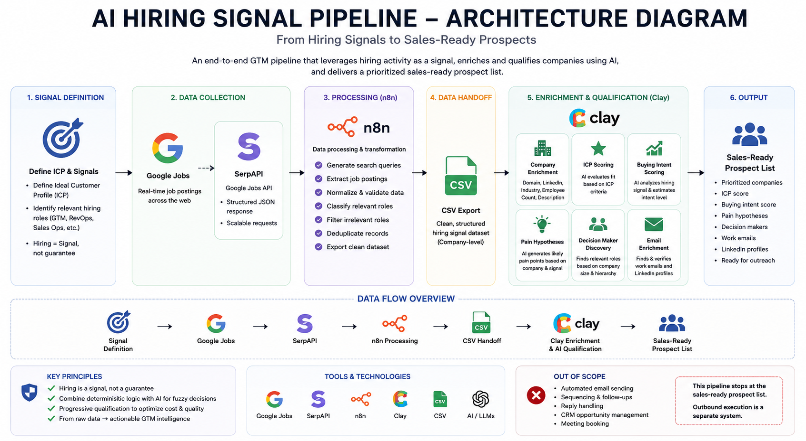
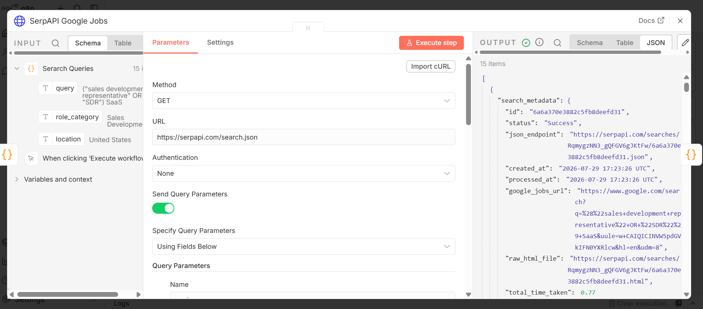
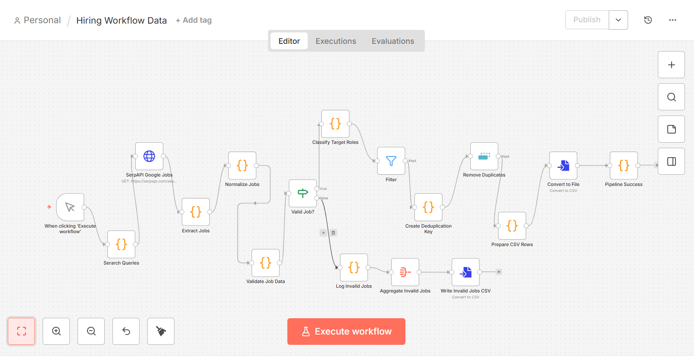
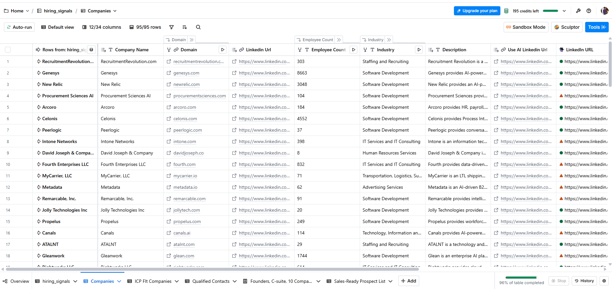
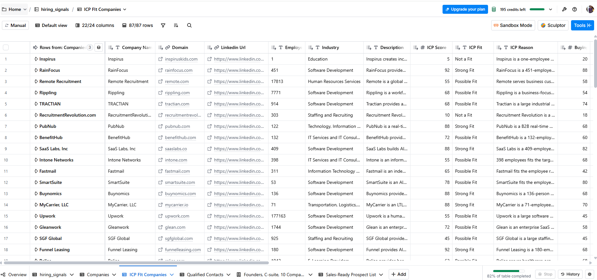
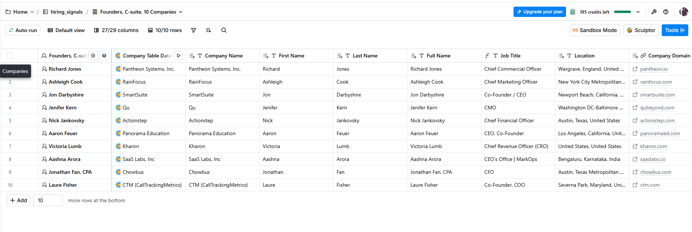
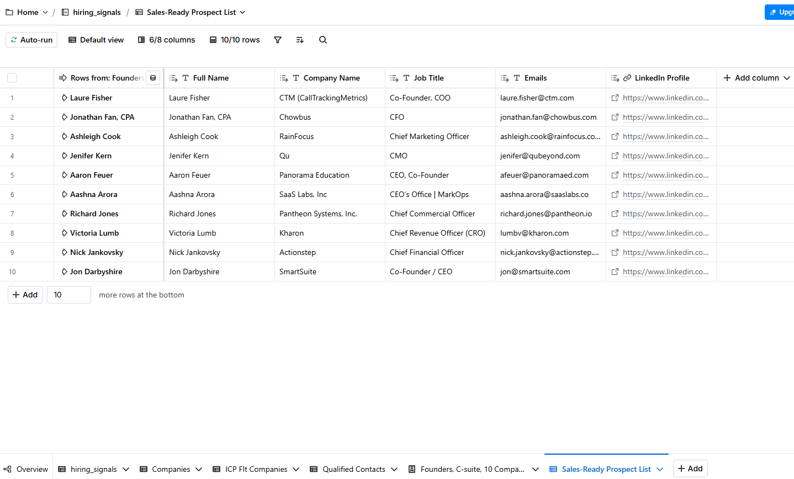

# AI Hiring Signal Pipeline

An end-to-end GTM Engineering pipeline that identifies companies showing relevant hiring signals and converts raw job-posting data into a prioritized, enriched, sales-ready prospect list.

The project demonstrates how **hiring activity can be used as a GTM signal** and combined with data enrichment, AI-assisted qualification, buying-intent scoring, and decision-maker discovery.

---

## The Problem

Traditional prospecting often starts with static company lists based on attributes such as industry, employee count, or location.

While these attributes help define an Ideal Customer Profile (ICP), they don't necessarily indicate **why a company may need a solution right now**.

This project explores hiring activity as an additional signal.

For example, companies hiring for roles across:

- Revenue Operations
- GTM Operations
- Sales Operations
- Marketing Operations
- Revenue Systems
- Customer Support Operations

may be investing in or experiencing growing complexity within those functions.

Hiring alone does **not** guarantee purchase intent. It is treated as a signal that becomes more useful when combined with company fit, enrichment, and qualification.

---

## Solution

The pipeline converts raw hiring activity into actionable prospect intelligence through four stages:

**1. Signal Collection**  
Identify relevant job postings using targeted search queries and Google Jobs data through SerpAPI.

**2. Data Processing**  
Use n8n to extract, normalize, validate, classify, filter, and deduplicate job records.

**3. Enrichment & Qualification**  
Use Clay to enrich company information and apply AI-assisted ICP qualification, buying-intent scoring, and pain hypotheses.

**4. Prospect Discovery**  
Identify relevant decision makers, enrich work emails, and create a final sales-ready prospect list.

The final output is designed to answer:

> **Which companies should sales prioritize, why might they be relevant now, and who should they contact?**

---

## Architecture



### High-Level Flow

```text
Hiring Signal Definition
        ↓
Google Jobs / SerpAPI
        ↓
n8n Data Processing
        ↓
Clean Hiring Signal Dataset
        ↓
Clay Company Enrichment
        ↓
ICP Qualification
        ↓
Buying Intent Scoring
        ↓
Pain Hypothesis Generation
        ↓
Decision Maker Discovery
        ↓
Work Email Enrichment
        ↓
Sales-Ready Prospect List
```

---

## Workflow

### 1. Define Hiring Signals

Before collecting data, target roles are defined based on the business hypothesis.

The idea is not:

> Company is hiring → Company will buy.

Instead:

> Relevant hiring activity + ICP fit + company context = stronger reason to investigate and prioritize an account.

This keeps hiring activity as a **signal**, rather than treating it as proof of purchase intent.

---

### 2. Generate Search Queries

n8n generates targeted job-search queries for relevant GTM and revenue-related roles.

Examples include searches around:

- GTM Operations
- Revenue Operations
- Sales Operations
- Revenue Systems
- Marketing Operations
- Customer Support Operations

Multiple role variations improve coverage because companies frequently use different titles for similar responsibilities.

---

### 3. Collect Job Data with SerpAPI

The workflow calls the SerpAPI Google Jobs endpoint for each generated search query.

SerpAPI returns structured JSON containing job information such as:

- Company
- Job title
- Location
- Employment type
- Posting information
- Job description
- Source
- Job URL

This provides structured job data that can be processed programmatically inside n8n.



---

### 4. Process Data in n8n

n8n acts as the orchestration and transformation layer.

The workflow:

```text
Generate Search Queries
        ↓
SerpAPI Request
        ↓
Extract Jobs
        ↓
Normalize Data
        ↓
Validate Records
        ↓
Classify Target Roles
        ↓
Filter Relevant Roles
        ↓
Create Deduplication Key
        ↓
Remove Duplicates
        ↓
Export CSV
```



### Data Validation

Records are checked for the fields required by downstream processing.

Valid records continue through the pipeline, while invalid records are separated into a different branch for inspection rather than silently contaminating the final dataset.

### Role Classification

Job titles are mapped into relevant GTM categories so that unrelated hiring activity can be removed.

### Deduplication

A deterministic deduplication key is generated from job attributes to prevent repeated job postings from unnecessarily entering downstream enrichment.

---

## Why CSV?

The cleaned dataset is exported from n8n as CSV before being imported into Clay.

For this portfolio implementation, CSV provides a simple and transparent handoff between the two systems.

In a production implementation, this handoff could instead use:

- APIs
- Webhooks
- Databases
- Google Sheets
- CRM integrations

The architecture is therefore not dependent on CSV; it is simply the integration method used for this implementation.

---

## Company Enrichment in Clay

The cleaned hiring dataset is imported into Clay and transformed from job-level data into company-level intelligence.

Company enrichment includes:

- Company domain
- LinkedIn URL
- Employee count
- Industry
- Company description

Waterfall enrichment is used where appropriate to improve coverage across data providers.



---

## AI-Assisted Qualification

AI is used for qualitative analysis where deterministic rules alone would be too rigid.

The AI does not independently decide what constitutes a good customer.

Instead, predefined business criteria are provided and AI evaluates available company information against those criteria.

### ICP Score

The ICP score answers:

> **Is this generally the type of company we want to target?**

Factors include company characteristics such as:

- Business model
- Industry
- Employee count
- Company description
- Relevance to the hypothetical solution

Companies receive a score and classification such as **Strong Fit**, **Possible Fit**, or **Not a Fit**.

### Buying Intent Score

Buying intent answers a different question:

> **Does the current signal suggest that this account may have a relevant need now?**

A company can therefore have:

**High ICP Fit + Low Intent**

or:

**Moderate ICP Fit + High Intent**

Separating these concepts prevents company fit and timing from being incorrectly treated as the same thing.



---

## Pain Hypothesis Generation

For qualified companies, AI generates potential pain hypotheses based on available company context and hiring activity.

For example, hiring across revenue operations may indicate possible challenges around:

- CRM processes
- Manual GTM workflows
- Reporting
- Data consistency
- Sales automation
- Scaling operational processes

These are deliberately treated as **hypotheses, not facts**.

Their purpose is to provide sales with context for research and personalization.

---

## Decision-Maker Discovery

Once companies have been qualified and prioritized, the pipeline identifies relevant people within those organizations.

Target roles vary based on company structure and may include:

- Head / VP of Revenue Operations
- Revenue Operations Manager
- Sales Operations leadership
- GTM Operations
- GTM Engineer
- CRO / Revenue leadership
- Founder / CEO / COO for smaller organizations

The goal is to connect the identified business signal to a person who could plausibly own the associated problem.



---

## Work Email Enrichment

Work email enrichment is performed for selected decision makers.

The resulting contact record combines:

```text
Company
+
Hiring Signal
+
Company Context
+
ICP Fit
+
Buying Intent
+
Pain Hypothesis
+
Decision Maker
+
Work Email
+
LinkedIn Profile
```

---

## Final Output

The pipeline produces a **Sales-Ready Prospect List** containing prioritized companies and relevant contacts.



Instead of handing sales a raw list of companies, the final output provides context around:

- Which company to prioritize
- Why the company fits
- Why the timing may be relevant
- What potential pain exists
- Who to contact
- How to reach them

---

## Tech Stack

| Tool | Purpose |
|---|---|
| **SerpAPI** | Google Jobs data collection |
| **n8n** | Workflow orchestration, transformation and validation |
| **Clay** | Company/contact enrichment and qualification |
| **AI / LLMs** | ICP analysis, intent scoring and pain hypotheses |
| **CSV** | Handoff between n8n and Clay |

---

## Key Design Decisions

### Hiring is treated as a signal, not proof

Hiring activity increases the relevance of an account but does not guarantee purchase intent.

### Deterministic logic + AI

Structured operations such as validation, filtering and deduplication use deterministic logic.

AI is reserved for fuzzy tasks such as company qualification and pain hypothesis generation.

### Progressive qualification

Expensive enrichment and contact discovery happen later in the funnel rather than enriching every raw job record.

This reduces unnecessary processing and enrichment costs.

### Job-level → Company-level → Person-level

The pipeline progressively changes the unit of analysis:

```text
Job Posting
    ↓
Company
    ↓
Qualified Account
    ↓
Decision Maker
    ↓
Sales-Ready Prospect
```

---

## Scope

This project intentionally stops at the **sales-ready prospect list**.

It does **not** automate outbound execution.

Not included:

- Personalized email generation
- Automated email sending
- Sequencing
- Follow-ups
- Reply classification
- CRM opportunity management
- Meeting booking

Those processes introduce separate concerns including deliverability, message quality, compliance, sending limits, reply handling, and CRM state management.

They are better treated as a separate outbound system rather than expanding the scope of this project.

---

## Limitations & Future Improvements

This is a portfolio implementation rather than a production deployment.

Potential production improvements include:

- Scheduled signal collection
- Direct API/database handoff instead of CSV
- Retry and failure-handling strategies
- API schema-change monitoring
- Logging and observability
- Persistent deduplication across workflow runs
- Human review for uncertain AI classifications
- CRM integration
- Additional intent signals beyond hiring
- Cost and enrichment-credit optimization

These were intentionally kept outside the current implementation to keep the project focused on the core GTM signal-to-prospect workflow.

---

## Repository Structure

```text
ai-hiring-signal-pipeline/
│
├── README.md
│
├── docs/
│   ├── architecture-diagram.png
│   └── workflow-overview.png
│
├── screenshots/
│   ├── 01-n8n-workflow.png
│   ├── 02-serpapi-output.png
│   ├── 03-clay-import.png
│   ├── 04-company-enrichment.png
│   ├── 05-icp-scoring.png
│   ├── 06-contact-discovery.png
│   └── 07-final-sales-ready-list.png
│
├── sample_data/
│   ├── sample_input.csv
│   └── sample_output.csv
│
├── workflow/
│   └── hiring_signal_pipeline.json
│
└── LICENSE
```

---

## What This Project Demonstrates

This project demonstrates practical GTM Engineering concepts including:

- Signal-based prospecting
- API-driven data collection
- Workflow automation
- Data normalization and validation
- Deduplication
- Company enrichment
- AI-assisted GTM qualification
- ICP modeling
- Buying-intent prioritization
- Pain hypothesis generation
- Decision-maker discovery
- Contact enrichment
- Cross-tool workflow design

The core principle is simple:

> **Raw data becomes valuable only when it is transformed into context that helps someone make a better GTM decision.**
